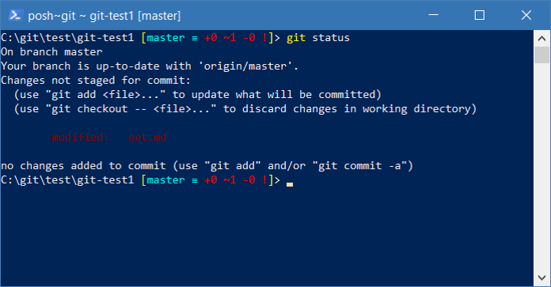

# GIT v PowerShellu - nadstavba Posh-Git   
Posh-Git je šikovný nástroj pro zobrazování Git repozitářů a barevných stavů. 


## Nejjednodušší instalace
Stáhněte si balíček s Posh-Git zde https://github.com/dahlbyk/posh-git/archive/v0.7.3.1.zip 

Do složky **"c:\Program Files\WindowsPowerShell\Modules\posh-git\0.7.3\"** nakopírujte obsah ze složky src ze zip souboru.

Ve složce **"C:\Users\<username>\Documents\WindowsPowerShell"** vytvořte soubor **Profile.ps1** a do něj napište příkaz ```Import-Module posh-git```.
Pokud již soubor existuje, doplňte jen uvedený příkaz.

Spusťte PowerShell.


## Ruční instalace 
Zde je popsáno jak lze Posh-Git nainstalovat
https://git-scm.com/book/cs/v2/Appendix-A%3A-Git-in-Other-Environments-Git-in-Powershell
https://github.com/dahlbyk/posh-git

Vlastní modul lze stáhnout zde: https://www.powershellgallery.com/packages/posh-git/0.7.3 nebo v našem repozitáři https://github.com/AutoContCZ/GIT-Training/tree/master/Install/posh-git/0.7.3. 

Stažené soubory uložte do složky "c:\Program Files\WindowsPowerShell\Modules\posh-git". 

Následně stačí při spuštění PowerShellu provést import modulu
```Import-Module "c:\Program Files\WindowsPowerShell\Modules\posh-git\0.7.3\posh-git.psd1"```


Pokud toto chci mít automaticky vždy k dispozici, přidám daný import modulu do svého Profilu ```profile.ps1```, který obvykle bývá v C:\Users\<username>\Documents\WindowsPowerShell.

Kde leží profil pro aktuálního uživatele lze zjistit v proměnné ```$profile.CurrentUserAllHosts```

Takto jej mohu modifikovat ```notepad $profile.CurrentUserAllHosts```

Pokud tam není soubor Profile.ps1, stačí jej založit a přidat do něj řádek s importem ```Import-Module posh-git```. Pro jednoduchost je připravený soubor ```Profile.ps1``` v https://github.com/AutoContCZ/GIT-Training/tree/master/Install/posh-git.


